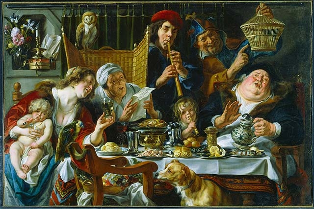

  

    In the courtyard between the buildings. Head to the second floor and take the exit out of the back of the stairwell by the elevator. 
  

<iframe src="https://www.google.com/maps/embed?pb=!1m18!1m12!1m3!1d700.163800528273!2d-75.70044787073107!3d45.41629209869377!2m3!1f0!2f0!3f0!3m2!1i1024!2i768!4f13.1!3m3!1m2!1s0x4cce04533ab0e2a1%3A0x6232e403b95327e1!2sHudson+Park!5e0!3m2!1sen!2sca!4v1535945770886" width="300" height="300" frameborder="0" style="border:0" allowfullscreen></iframe>

  

  
 

  

    <h2>When you've arrived...</h2>
    The door has a small sign on it for people coming and going. What's the fifth word on the sign?
  

 

  <form id="FirstQ" onSubmit="dogs(); return false;">
    <input type="text" id="answer" name="user_name" />
    <input type="button" value="Check" onclick="dogs(); return false;" />
  </form>

  

  

   
  <h2>A closer look</h2>
  
  

   

  

  

   
  <h2>The last step</h2>
  Find your gentleman friend and say to him the magical phrase:
   
  <b>
  

  </b>
   

  

